# ⛳️ GIS-based Real-world Golf Simulator


> **실제 지형 데이터(DEM 90m)를 활용하여 국내 실외 골프장의 지형을 유니티 상에 모델링한 GIS 기반 골프 시뮬레이션 프로젝트입니다.**

<br/>

## 📸 Project Showcase
.png)
.png)
<br/>

## 📝 Introduction
단순한 가상 지형 디자인이 아닌, **공간 정보(GIS) 데이터를 게임 엔진에서 활용 가능한 형태로 가공하는 자동화 파이프라인**을 구축하는 데 초점을 맞췄습니다.
국가공간정보포털의 수치표고모델(DEM) 데이터를 파싱하여 Unity Terrain으로 변환하고, 실제 지형의 경사도에 따른 리얼한 물리 상호작용을 구현했습니다.

### Key Features
- **GIS Data Parsing**: DEM(Digital Elevation Model) 원본 데이터를 16bit Heightmap으로 변환
- **Digital Twin**: 실제 골프장 지형을 1:1 스케일로 유니티 엔진에 재현
- **Physics Interaction**: 지형의 Normal Vector를 실시간 계산하여 경사면에 따른 공의 굴절/가속 구현
- **Custom Shader**: HLSL 기반의 커스텀 쉐이더로 잔디 및 물 표현 최적화

<br/>

## 🏗 System Architecture (Data Pipeline)

GIS 데이터가 유니티 엔진의 지형으로 변환되는 데이터 처리 파이프라인입니다.



## 🛠 Tech Stack

| Category | Technology | Description |
| --- | --- | --- |
| **Engine** | Unity 2022.3 (LTS) | URP (Universal Render Pipeline) 기반 개발 |
| **Language** | C# | 핵심 로직 및 물리 제어 |
| **GIS Tool** | QGIS / GDAL | DEM 데이터 전처리 및 좌표계 변환 |
| **Graphics** | HLSL / Shader Graph | 지형 텍스처 블렌딩 및 물 쉐이더 |

<br/>

## 📂 Implementation Details

### 1. DEM to Heightmap Conversion
* 원본 DEM 파일(.img/.tif)의 고도 값을 읽어와 Unity Terrain이 인식할 수 있는 `0.0 ~ 1.0` 범위의 정규화된 값으로 변환합니다.
* 데이터 손실을 최소화하기 위해 **16-bit Raw format**을 사용하여 계단 현상(Terracing Artifacts)을 방지했습니다.

### 2. Terrain Physics
* `Raycast`를 통해 현재 공이 위치한 지면의 **Normal Vector(법선 벡터)**를 추출합니다.
* 경사각에 따라 중력 가속도를 보정(`Vector3.ProjectOnPlane`)하여, 오르막/내리막 퍼팅 시 물리적인 저항을 다르게 적용했습니다.

<br/>

## 🏆 Project Outcomes
* 가상의 디자인이 아닌 **실측 데이터 기반의 디지털 트윈(Digital Twin) 구축 프로세스**를 확립했습니다.
* 실제 골프장과 지형적 특성이 동일한 시뮬레이션 환경을 구축하여 현실적인 난이도 밸런싱을 구현했습니다.

<br/>

## 🚀 How to Run
1. Clone this repository.
   ```bash
   git clone [https://github.com/wns5255/unity-golf-simulator.git](https://github.com/wns5255/unity-golf-simulator.git)
